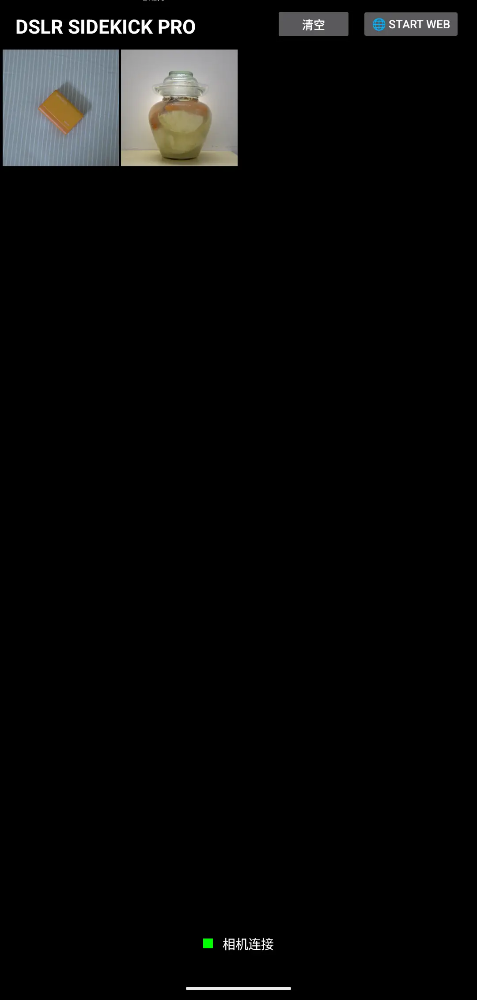
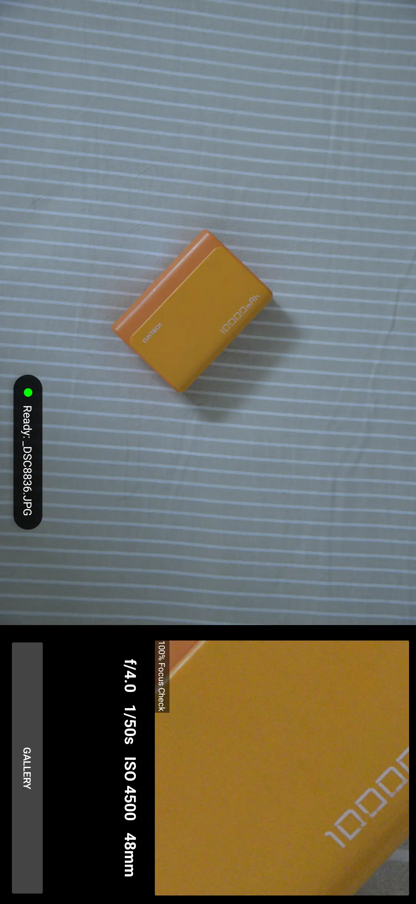
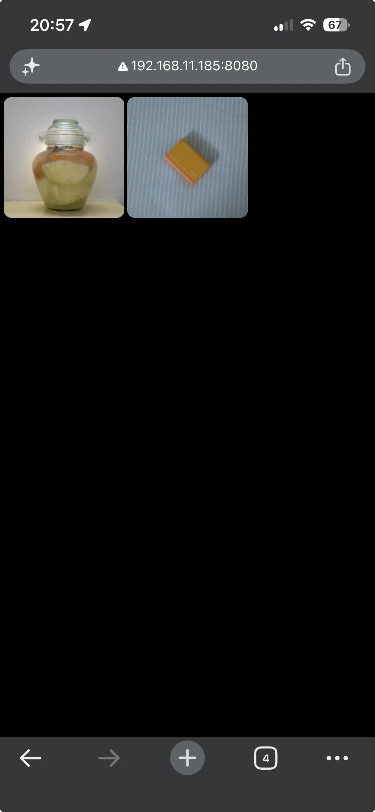

# DSLR Sidekick PRO

DSLR Sidekick PRO is an Android app for photographers who want a simple way to connect a DSLR or mirrorless camera to an Android device over USB, import photos, review them, and share a local WiFi gallery.

The app uses `libgphoto2` and `libusb` through JNI for camera communication, and includes a lightweight local web server for browsing photos from another device on the same network.

## Screenshot

| Gallery | Preview | Web Share |
|---------|---------|-----------|
|  | | |

## Main features

- Connect supported USB cameras to an Android device.
- Detect common DSLR and mirrorless camera vendors automatically.
- Sync photos from the camera into the app gallery.
- Use focus-check style viewing with face detection support.
- Share a local WiFi photo gallery through the built-in web server.

## Supported cameras

The app is designed around PTP-compatible cameras and includes known vendor support for:

- Nikon
- Canon
- Sony
- Fuji

Other PTP class USB devices may also be detected, depending on camera support in `libgphoto2`.

## Tech stack

- Android app written in Kotlin
- Native camera layer written in C++
- JNI bridge between Kotlin and native code
- `libgphoto2` for camera control
- `libusb` for USB communication
- NanoHTTPD for the local WiFi gallery server
- Glide for image loading
- ML Kit Face Detection for face-assisted viewing
- Sentry for crash and error reporting

## Basic usage

1. Install and open DSLR Sidekick PRO on an Android device.
2. Connect a camera with a USB cable.
3. Allow USB access when Android asks for permission.
4. Wait for the app to detect the camera.
5. Sync or browse imported photos in the gallery.
6. Open a photo to inspect it in the full-screen viewer.
7. Start the WiFi gallery server when you want to browse photos from another device on the same network.
